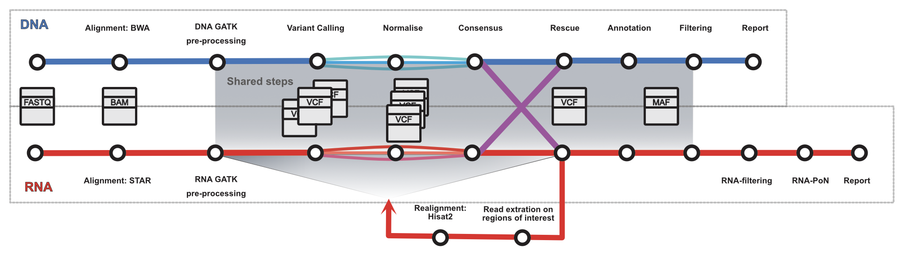

# :warning: UNDER ACTIVE DEVELOPMENT :warning: 

Hi beta-tester, thanks for agreeing to help out in this 
repo. I have created a [project](https://github.com/users/RaqManzano/projects/2) to add issues/tasks. 
Plese feel free to use the [issues tab](https://github.com/RaqManzano/nfcore_rnadnavar/issues). I am currently 
working on a draft for this methods so if you end up 
using this pipeline or bits of it I would appreciate 
your citation (to be added).


#  

[](https://github.com/nf-core/rnadnavar/actions?query=workflow%3A%22nf-core+CI%22)
[](https://github.com/nf-core/rnadnavar/actions?query=workflow%3A%22nf-core+linting%22)
[](https://nf-co.re/rnadnavar/results)
[](https://doi.org/10.5281/zenodo.XXXXXXX)

[](https://www.nextflow.io/)
[](https://docs.conda.io/en/latest/)
[](https://www.docker.com/)
[](https://sylabs.io/docs/)
[](https://tower.nf/launch?pipeline=https://github.com/nf-core/rnadnavar)

[](https://nfcore.slack.com/channels/rnadnavar)
[](https://twitter.com/nf_core)
[](https://www.youtube.com/c/nf-core)


## Note for beta testers

Profiles have not been tested yet. At the moment to run 
the pipeline you will need:

- DNA and RNA tumour BAM/FASTQ files and DNA normal BAM 
  file 
  (this is what I have been testing so far)
- Reference files
  - Use the same reference file you used for your BAM file
  - There are other reference files for some of the 
    filtering steps. Those files are optional so should 
    not be required for testing, however if you want to 
    run it with everything let me know and I can provide 
    them for you.
- I recommend that for starting thing you generate a 
  profile similar to the example I have in 
  `config/tcga_train_set.config` and a input table like 
  `assets/TargetsFileTCGA1Sample.csv`
- Note that RNA only mode has not been tested yet. At 
  the moment everything run with DNA-RNA in parallel. I 
  suspect it should be okay until the consensus step, 
  which might require some changes to allow RNA only data.


## Introduction

The **nf-core/rnadnavar** is a bioinformatics best-practice 
analysis pipeline for Pipeline for RNA and DNA 
integrated analysis for somatic mutation detection.

Initially designed for cancer research, the pipeline  
uses different variant calling algorithms and applies a 
consensus approach. A final filtering stage, should 
provide a set of annotated somatic variants.

The pipeline is built using [Nextflow](https://www.nextflow.io), a workflow tool to run tasks across 
multiple compute infrastructures in a very portable 
manner. It uses Docker/Singularity containers making 
installation trivial and results highly reproducible. 
The [Nextflow DSL2](https://www.nextflow.io/docs/latest/dsl2.html) implementation of this 
pipeline uses one container per process which makes it 
much easier to maintain and update software 
dependencies. Where possible, these processes have been 
submitted to and installed from [nf-core/modules](https://github.com/nf-core/modules) in order to make them available to all nf-core pipelines, and to everyone within the Nextflow community!

On release, automated continuous integration tests run the pipeline on a full-sized dataset on the AWS cloud infrastructure. This ensures that the pipeline runs on AWS, has sensible resource allocation defaults set to run on real-world datasets, and permits the persistent storage of results to benchmark between pipeline releases and other analysis sources. The results obtained from the full-sized test can be viewed on the [nf-core website](https://nf-co.re/rnadnavar/results).


## Pipeline summary

<!-- TODO nf-core: Fill in short bullet-pointed list of the default steps in the pipeline -->

1. Read QC ([`FastQC`](https://www.bioinformatics.babraham.ac.uk/projects/fastqc/))
2. Present QC for raw reads ([`MultiQC`](http://multiqc.info/))
3. Alignment (BWA/STAR)
3. GATK pre-processing
4. Variant calling
5. Normalise calls
6. Annotation
7. Consensus
8. Filtering
9. Realignment [OPT]
10. RNA filtering

<p align="center">
    
</p>


## Quick Start

1. Install [`Nextflow`](https://www.nextflow.io/docs/latest/getstarted.html#installation) (`>=21.10.3`)

2. Install any of [`Docker`](https://docs.docker.com/engine/installation/), [`Singularity`](https://www.sylabs.io/guides/3.0/user-guide/) (you can follow [this tutorial](https://singularity-tutorial.github.io/01-installation/)), [`Podman`](https://podman.io/), [`Shifter`](https://nersc.gitlab.io/development/shifter/how-to-use/) or [`Charliecloud`](https://hpc.github.io/charliecloud/) for full pipeline reproducibility _(you can use [`Conda`](https://conda.io/miniconda.html) both to install Nextflow itself and also to manage software within pipelines. Please only use it within pipelines as a last resort; see [docs](https://github.com/RaqManzano/nfcore_rnadnavar/blob/dev/docs/usage.md))_.

3. Download the pipeline and test it on a minimal dataset with a single command:

   ```console
   # Not working/tested yet - it is the todo list
   nextflow run nf-core/rnadnavar -profile test,YOURPROFILE --outdir <OUTDIR>
   ```

   Note that some form of configuration will be needed so that Nextflow knows how to fetch the required software. This is usually done in the form of a config profile (`YOURPROFILE` in the example command above). You can chain multiple config profiles in a comma-separated string.

   > - The pipeline comes with config profiles called `docker`, `singularity`, `podman`, `shifter`, `charliecloud` and `conda` which instruct the pipeline to use the named tool for software management. For example, `-profile test,docker`.
   > - Please check [nf-core/configs](https://github.com/nf-core/configs#documentation) to see if a custom config file to run nf-core pipelines already exists for your Institute. If so, you can simply use `-profile <institute>` in your command. This will enable either `docker` or `singularity` and set the appropriate execution settings for your local compute environment.
   > - If you are using `singularity`, please use the [`nf-core download`](https://nf-co.re/tools/#downloading-pipelines-for-offline-use) command to download images first, before running the pipeline. Setting the [`NXF_SINGULARITY_CACHEDIR` or `singularity.cacheDir`](https://www.nextflow.io/docs/latest/singularity.html?#singularity-docker-hub) Nextflow options enables you to store and re-use the images from a central location for future pipeline runs.
   > - If you are using `conda`, it is highly recommended to use the [`NXF_CONDA_CACHEDIR` or `conda.cacheDir`](https://www.nextflow.io/docs/latest/conda.html) settings to store the environments in a central location for future pipeline runs.

4. Start running your own analysis!

   <!-- TODO nf-core: Update the example "typical command" below used to run the pipeline -->

   ```console
   nextflow run nf-core/rnadnavar --input samplesheet.
   csv --outdir <OUTDIR> --genome GRCh38 -profile 
   <docker/singularity/to/add/test/here>
   ```

## Documentation

The nf-core/rnadnavar pipeline comes with documentation about the pipeline [usage](https://github.com/RaqManzano/nfcore_rnadnavar/blob/dev/docs/usage.md), [parameters](https://nf-co.re/rnadnavar/parameters) and [output](https://nf-co.re/rnadnavar/output).

## Credits

The nf-core/rnadnavar was originally written by Raquel 
Manzano Garcia at Cancer Research UK Cambridge Institute 
with the initial and continuous support of Maxime U 
Garcia. The workflow is based on 
[RNA-MuTect](https://github.
com/broadinstitute/RNA_MUTECT_1.0-1) which was 
originally published by [Yizhak, *et al* 2019 (Science)]
(https://www.science.org/doi/10.1126/science.aaw0726)

We thank the following people for their assistance in the development of this pipeline:
TBC

<!-- TODO nf-core: If applicable, make list of people who have also contributed -->

## Contributions and Support

If you would like to contribute to this pipeline, please see the [contributing guidelines](.github/CONTRIBUTING.md).

For further information or help, don't hesitate to get in touch on the [Slack `#rnadnavar` channel](https://nfcore.slack.com/channels/rnadnavar) (you can join with [this invite](https://nf-co.re/join/slack)).

## Citations

<!-- TODO nf-core: Add citation for pipeline after first release. Uncomment lines below and update Zenodo doi and badge at the top of this file. -->
<!-- If you use  nf-core/rnadnavar for your analysis, please cite it using the following doi: [10.5281/zenodo.XXXXXX](https://doi.org/10.5281/zenodo.XXXXXX) -->

<!-- TODO nf-core: Add bibliography of tools and data used in your pipeline -->

An extensive list of references for the tools used by the pipeline can be found in the [`CITATIONS.md`](CITATIONS.md) file.

You can cite the `nf-core` publication as follows:

> **The nf-core framework for community-curated bioinformatics pipelines.**
>
> Philip Ewels, Alexander Peltzer, Sven Fillinger, Harshil Patel, Johannes Alneberg, Andreas Wilm, Maxime Ulysse Garcia, Paolo Di Tommaso & Sven Nahnsen.
>
> _Nat Biotechnol._ 2020 Feb 13. doi: [10.1038/s41587-020-0439-x](https://dx.doi.org/10.1038/s41587-020-0439-x).
