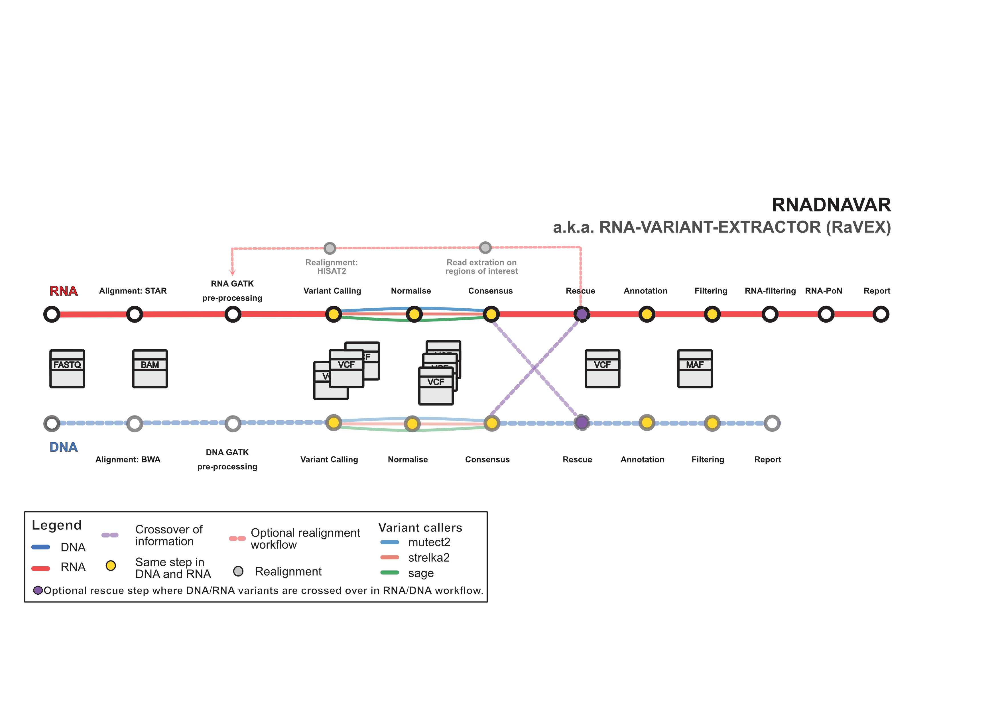

# :warning: UNDER ACTIVE DEVELOPMENT :warning:

#  

[](https://nf-co.re/rnadnavar/results)[](https://doi.org/10.5281/zenodo.XXXXXXX)

[](https://www.nextflow.io/)
[](https://docs.conda.io/en/latest/)
[](https://www.docker.com/)
[](https://sylabs.io/docs/)
[](https://tower.nf/launch?pipeline=https://github.com/nf-core/rnadnavar)

[](https://nfcore.slack.com/channels/rnadnavar)[](https://twitter.com/nf_core)[](https://mstdn.science/@nf_core)[](https://www.youtube.com/c/nf-core)

## Introduction

The **nf-core/rnadnavar** is a bioinformatics best-practice
analysis pipeline for RNA somatic mutation detection
able to perform in parallel.

Initially designed for cancer research, the pipeline
uses different variant calling algorithms and applies a
consensus approach. A final filtering stage, should
provide a set of annotated somatic variants.

The pipeline is built using [Nextflow](https://www.nextflow.io), a workflow tool to run tasks across
multiple compute infrastructures in a very portable
manner. It uses Docker/Singularity containers making
installation trivial and results highly reproducible.
The [Nextflow DSL2](https://www.nextflow.io/docs/latest/dsl2.html) implementation of this
pipeline uses one container per process which makes it
much easier to maintain and update software
dependencies. Where possible, these processes have been
submitted to and installed from [nf-core/modules](https://github.com/nf-core/modules) in order to make them available to all nf-core pipelines, and to everyone within the Nextflow community!

<!-- TODO nf-core:
  Complete this sentence with a 2-3 sentence summary of what types of data the pipeline ingests, a brief overview of the
  major pipeline sections and the types of output it produces. You're giving an overview to someone new
  to nf-core here, in 15-20 seconds. For an example, see https://github.com/nf-core/rnaseq/blob/master/README.md#introduction
-->

## Pipeline summary

Depending on the options and samples provided, the
pipeline will run different tasks. This is controlled
mainly through `--step` and `--tools` parameters. This
is a summary of the possible tasks to run with the pipeline:

- Quality control and trimming (enabled by
  `--trim_fastq` and runs [`FastQC`](https://www.bioinformatics.babraham.ac.uk/projects/fastqc/) and
  [`fastp`](https://github.com/OpenGene/fastp))
- Map Reads to Reference (BWA-mem, BWA-mem2, dragmap
  and/or STAR)
- GATK preprocessing for DNA and RNA bulk sequencing
  samples (`GATK MarkDuplicates`, `GATK SplitNCigarReads`,`GATK
BaseRecalibrator` and `GATK ApplyBQSR`)
- Summarise alignment statistics (`samtools stats`, `mosdepth`)
- Variant calling (enabled with `--tools`)
  - `Mutect2`
  - `Strelka2`
  - `SAGE`
- Annotation with `VEP` (enabled with `--tools` adding
  `vep`)
- Normalisation of VCFs with VT (enabled with `--tools`
  adding `normalisation`)
- Transformation of VCF to MAF and consensus of variant
  calling results (enabled with `--tools` adding
  `consensus`)
- Filtering of MAF files applying optional gnomad,
  whitelisting and blacklisting (enabled with `--tools`
  adding `filtering`)
- Realignment step where reads from regions where a variant
  was found will be extracted and re-processed, only for
  RNA due to higher levels of background noise (enabled
  with `--tools` adding `realignment`).
- Filtering of MAF files specific for RNA (enabled with
  `--tools` adding `rna_filtering`)

<p align="center">
    
</p>

## Usage

> **Note**
> If you are new to Nextflow and nf-core, please refer to [this page](https://nf-co.re/docs/usage/installation) on how
> to set-up Nextflow. Make sure to [test your setup](https://nf-co.re/docs/usage/introduction#how-to-run-a-pipeline)
> with `-profile test` before running the workflow on actual data.

<!-- TODO nf-core: Describe the minimum required steps to execute the pipeline, e.g. how to prepare samplesheets.
    Explain what rows and columns represent. For instance (please edit as appropriate):

First, prepare a samplesheet with your input data that looks as follows:

`samplesheet.csv`:


```csv
sample,lane,fastq_1,fastq_2
CONTROL_REP1,LX,AEG588A1_S1_L002_R1_001.fastq.gz,
AEG588A1_S1_L002_R2_001.fastq.gz
```

Each row represents a fastq file (single-end) or a pair of fastq files (paired end).

-->

Now, you can run the pipeline using:

<!-- TODO nf-core: update the following command to include all required parameters for a minimal example -->

```bash
nextflow run nf-core/rnadnavar \
  -profile <docker/singularity/.../institute> \
  --input samplesheet.csv \
  --outdir <OUTDIR>
```

> **Warning:**
> Please provide pipeline parameters via the CLI or Nextflow `-params-file` option. Custom config files including those
> provided by the `-c` Nextflow option can be used to provide any configuration _**except for parameters**_;
> see [docs](https://nf-co.re/usage/configuration#custom-configuration-files).

For more details and further functionality, please refer to the [usage documentation](https://nf-co.re/rnadnavar/usage) and the [parameter documentation](https://nf-co.re/rnadnavar/parameters).

## Pipeline output

To see the results of an example test run with a full size dataset refer to the [results](https://nf-co.re/rnadnavar/results) tab on the nf-core website pipeline page.
For more details about the output files and reports, please refer to the
[output documentation](https://nf-co.re/rnadnavar/output).

## Credits

The nf-core/rnadnavar was originally written by Raquel
Manzano Garcia at Cancer Research UK Cambridge Institute
with the continuous support of [Maxime U Garcia](https://github.com/maxulysse). The
workflow is based on
[RNA-MuTect](https://github.com/broadinstitute/RNA_MUTECT_1.0-1) which was
originally published by [Yizhak, _et al_ 2019 (Science)](https://www.science.org/doi/10.1126/science.aaw0726)

We thank the following people for their assistance in the development of this pipeline:
TBC

<!-- TODO nf-core: If applicable, make list of people who have also contributed -->

## Contributions and Support

If you would like to contribute to this pipeline, please see the [contributing guidelines](.github/CONTRIBUTING.md).

For further information or help, don't hesitate to get in touch on the [Slack `#rnadnavar` channel](https://nfcore.slack.com/channels/rnadnavar) (you can join with [this invite](https://nf-co.re/join/slack)).

## Citations

<!-- TODO nf-core: Add citation for pipeline after first release. Uncomment lines below and update Zenodo doi and badge at the top of this file. -->
<!-- If you use  nf-core/rnadnavar for your analysis, please cite it using the following doi: [10.5281/zenodo.XXXXXX](https://doi.org/10.5281/zenodo.XXXXXX) -->

<!-- TODO nf-core: Add bibliography of tools and data used in your pipeline -->

An extensive list of references for the tools used by the pipeline can be found in the [`CITATIONS.md`](CITATIONS.md) file.

You can cite the `nf-core` publication as follows:

> **The nf-core framework for community-curated bioinformatics pipelines.**
>
> Philip Ewels, Alexander Peltzer, Sven Fillinger, Harshil Patel, Johannes Alneberg, Andreas Wilm, Maxime Ulysse Garcia, Paolo Di Tommaso & Sven Nahnsen.
>
> _Nat Biotechnol._ 2020 Feb 13. doi: [10.1038/s41587-020-0439-x](https://dx.doi.org/10.1038/s41587-020-0439-x).
